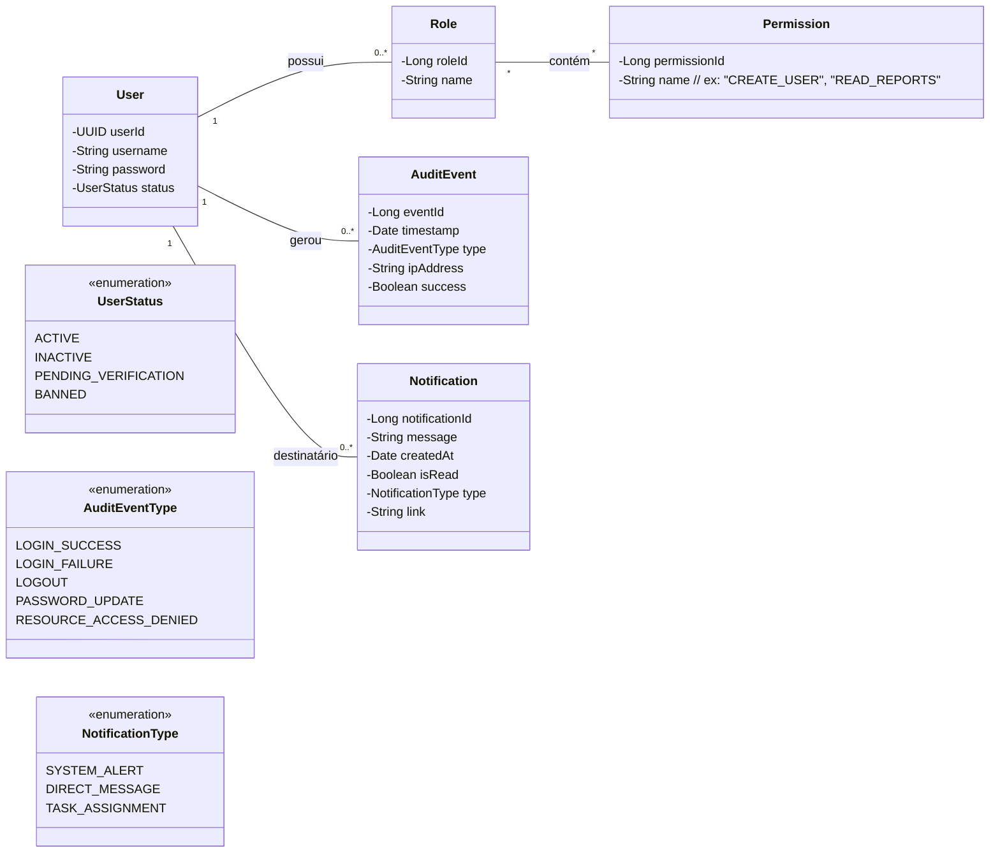
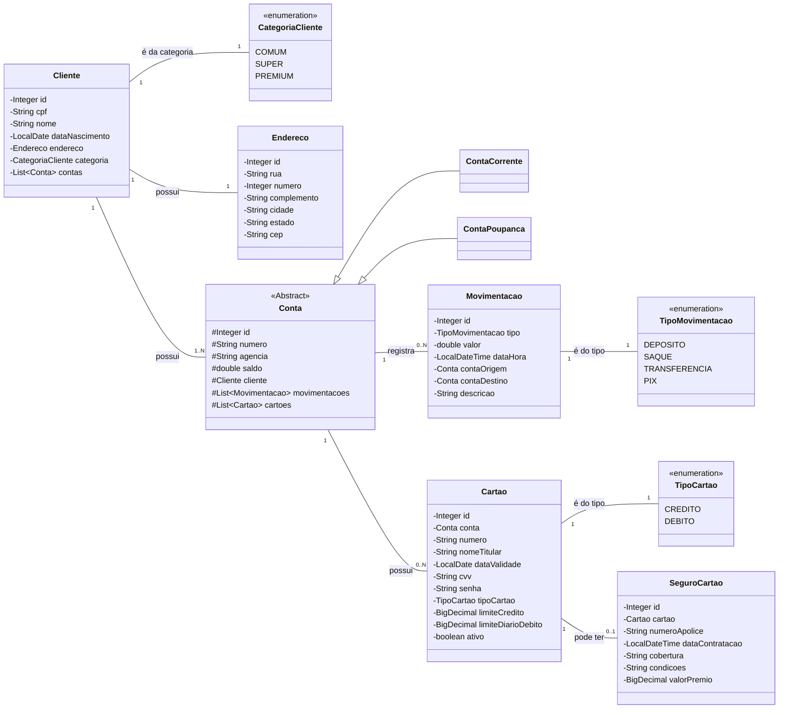
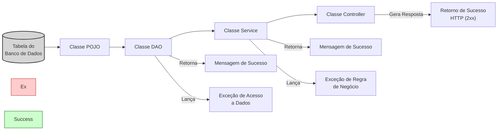
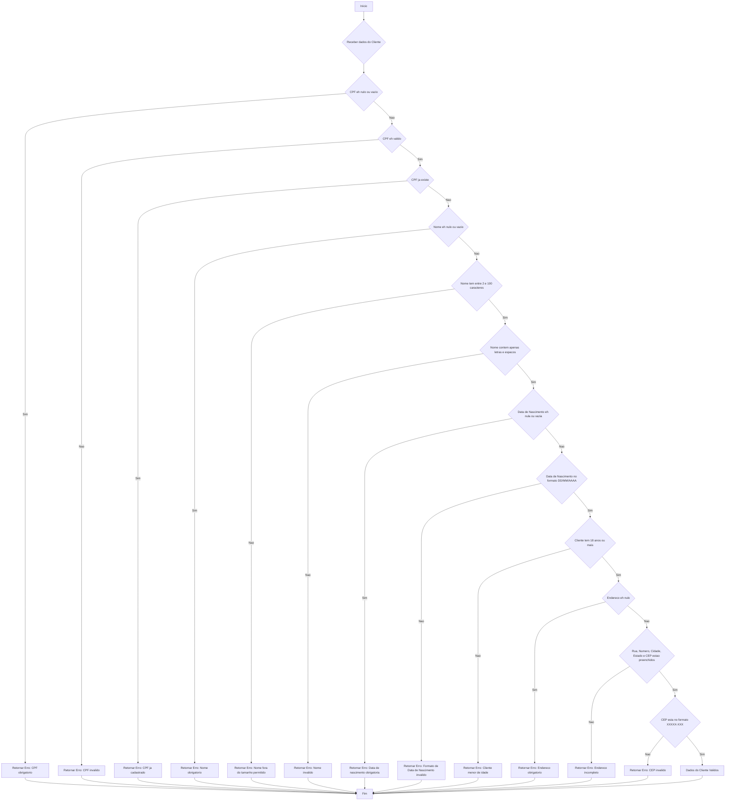

# Trilha de Aprendizado Java - EDUC360

# API para Banco Digital

Este projeto consiste no desenvolvimento de uma API RESTful robusta para um sistema de Banco Digital.
A aplicação simula as operações essenciais de uma instituição financeira, permitindo o gerenciamento 
completo de clientes, contas, cartões e seguros, com regras de negócio bem definidas para cada funcionalidade.

## Principais Funcionalidades

O sistema foi projetado para cobrir as seguintes áreas:

* **Autenticação:**
* O sistema utilizará o controle de autenticação por token JWT, como também fará o registro dos acessos ao sistema para cada usuário.

* **👤 Gestão de Clientes:**

    * Cadastro, consulta, atualização e exclusão de clientes (CRUD).
    * Classificação de clientes em três categorias: **Comum**, **Super** e **Premium**, que define o acesso a diferentes benefícios e taxas.
    * Validação rigorosa de dados na entrada, como formato e unicidade do CPF, idade: o cliente dever ser maior ou igual a 18 anos e obedecer o formato "DD/MM/AAAA", o cep deve obedecer o formato "XXXXX-XXX".

* **👤 Contas Bancárias:**

    * Abertura de **Conta Corrente** e **Conta Poupança**.
    * Operações essenciais como consulta de saldo, depósito, saque e transferências (incluindo Pix).
    * Lógica automatizada para desconto de **taxa de manutenção** (conta corrente) e aplicação de **rendimentos mensais** (conta poupança), com valores diferenciados por categoria de cliente.

* **💳 Gestão de Cartões:**

    * Emissão de cartões de **Crédito** e **Débito** vinculados às contas.
    * Funcionalidades para realizar pagamentos, alterar status (ativo/inativo), trocar senha e consultar faturas.
    * **Cartão de Crédito:** Possui limite pré-aprovado de acordo com a categoria do cliente e bloqueio automático de novas compras ao atingir o limite.
    * **Cartão de Débito:** Possui um limite de transação diário que pode ser ajustado pelo usuário.

* **🛡️ Seguros e Apólices:**

    * Contratação de seguros específicos para cartões de crédito.
    * Geração automática de apólices eletrônicas com número único, detalhes da cobertura e condições.

## 🛠️ Arquitetura da API

A API é RESTful e foi estruturada em torno dos principais recursos do sistema. Abaixo estão os endpoints planejados para cada módulo.

<strong>👤 Endpoints de Cliente</strong>

- `POST /clientes` - Criar um novo cliente
- `GET /clientes` - Listar todos os clientes
- `GET /clientes/{id}` - Obter detalhes de um cliente
- `PUT /clientes/{id}` - Atualizar informações de um cliente
- `DELETE /clientes/{id}` - Remover um cliente

<strong>👤 Endpoints de Conta</strong>

- `POST /contas` - Criar uma nova conta
- `GET /contas/{id}` - Obter detalhes de uma conta
- `GET /contas/{id}/saldo` - Consultar saldo da conta
- `POST /contas/{id}/deposito` - Realizar um depósito na conta
- `POST /contas/{id}/saque` - Realizar um saque da conta
- `POST /contas/{id}/transferencia` - Realizar uma transferência entre contas
- `POST /contas/{id}/pix` - Realizar um pagamento via Pix
- `PUT /contas/{id}/manutencao` - Aplicar taxa de manutenção (conta corrente)
- `PUT /contas/{id}/rendimentos` - Aplicar rendimentos (conta poupança)

<strong>💳 Endpoints de Cartão</strong>

- `POST /cartoes` - Emitir um novo cartão
- `GET /cartoes/{id}` - Obter detalhes de um cartão
- `POST /cartoes/{id}/pagamento` - Realizar um pagamento com o cartão
- `GET /cartoes/{id}/fatura` - Consultar fatura do cartão de crédito
- `POST /cartoes/{id}/fatura/pagamento` - Realizar pagamento da fatura
- `PUT /cartoes/{id}/senha` - Alterar senha do cartão
- `PUT /cartoes/{id}/status` - Ativar ou desativar um cartão
- `PUT /cartoes/{id}/limite` - Alterar limite do cartão de crédito
- `PUT /cartoes/{id}/limite-diario` - Alterar limite diário do cartão de débito

<strong>🛡️ Endpoints de Seguro</strong>

- `POST /seguros` - Contratar um seguro
- `GET /seguros` - Listar todos os seguros disponíveis
- `GET /seguros/{id}` - Obter detalhes de uma apólice de seguro
- `PUT /seguros/{id}/cancelar` - Cancelar uma apólice de seguro

## 🚀 Funcionalidades Adicionais

* **🔒 Autenticação e Autorização:** Implementação de `Spring Security` com `JWT` para proteger os endpoints e definir níveis de acesso (`ROLE_ADMIN`, `ROLE_CLIENTE`).

## Tecnologias utilizadas
- **Java 17**: Utilizei a versão LTS (Long Term Support) do Java para aproveitar as inovações e a robustez que essa linguagem oferece, garantindo performance e escalabilidade.
- **Spring Boot 3.3.1**: Trabalhei com a mais nova versão do Spring Boot, que maximiza a produtividade do desenvolvedor por meio de sua poderosa premissa de autoconfiguração.
- **Spring Data JPA**: Explorei como essa ferramenta pode simplificar minha camada de acesso aos dados, facilitando a integração com bancos de dados SQL.
- **Spring JDBC Template**: Para cenários que exigiam maior controle sobre as instruções SQL ou otimizações de performance, utilizei o Spring JDBC Template. Ele simplifica a interação com o banco de dados via JDBC, tratando o boilerplate de abertura e fechamento de conexões e convertendo exceções, o que me permitiu focar na lógica da query.
- **Spring Security**: Implementei a segurança da API utilizando o Spring Security, garantindo autenticação e autorização robustas para proteger os recursos do banco digital.
- **JWT (JSON Web Tokens)**: Para a autenticação, empreguei JWT, um método seguro e eficiente para transmitir informações entre as partes como um objeto JSON.
- **H2 Database**: Para desenvolvimento e testes, utilizei o H2, um banco de dados relacional em memória que agiliza o ciclo de desenvolvimento.
- **OpenAPI (Swagger)**: Criei uma documentação de API eficaz e fácil de entender usando a OpenAPI (Swagger), perfeitamente alinhada com a alta produtividade que o Spring Boot oferece.
- **JUnit 5**: Para garantir a robustez e a qualidade do código, adotei o JUnit 5 para a criação de testes unitários e de integração. 

## Link para visualizar os recursos da API

http://localhost:8080/swagger-ui/index.html

## Diagrama de Classes (Domínio da Aplicação)

## Fluxo de Camadas (Visão Estrutural)

## Fluxo de Requisição (Visão de Processamento)

