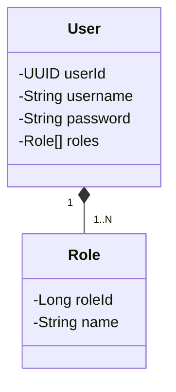
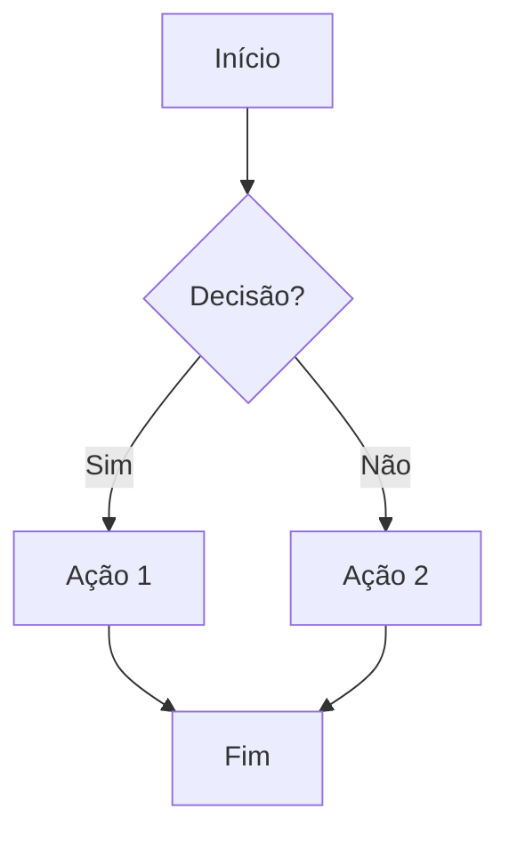
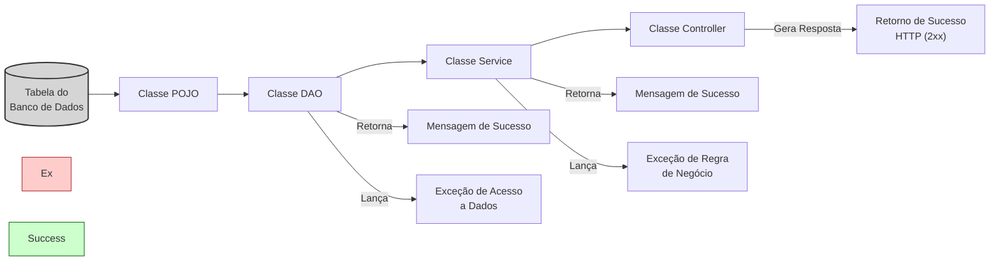
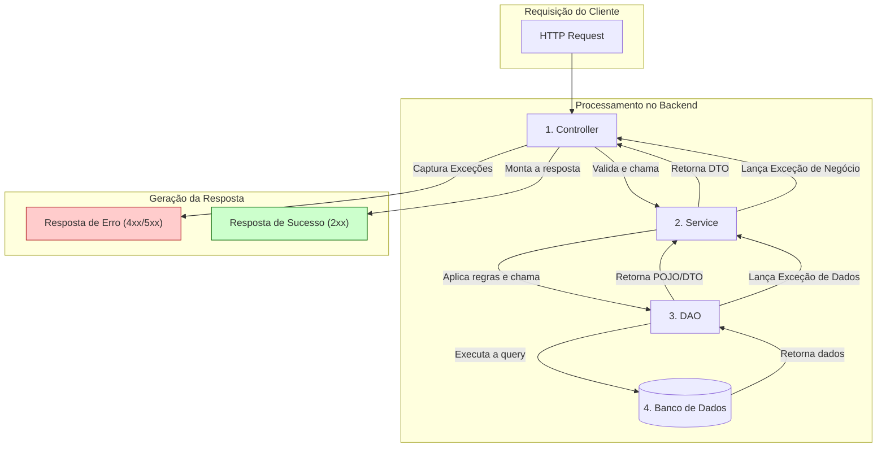

# Trilha de Aprendizado Java - EDUC360

Java RESTFul API criada para a simulação de um banco digital 

## Principais Tecnologias
- **Java 17**: Utilizei a versão LTS (Long Term Support) do Java para aproveitar as inovações e a robustez que essa linguagem oferece, garantindo performance e escalabilidade.
- **Spring Boot 3.3.1**: Trabalhei com a mais nova versão do Spring Boot, que maximiza a produtividade do desenvolvedor por meio de sua poderosa premissa de autoconfiguração.
- **Spring Data JPA**: Explorei como essa ferramenta pode simplificar minha camada de acesso aos dados, facilitando a integração com bancos de dados SQL.
- **Spring JDBC Template**: Para cenários que exigiam maior controle sobre as instruções SQL ou otimizações de performance, utilizei o Spring JDBC Template. Ele simplifica a interação com o banco de dados via JDBC, tratando o boilerplate de abertura e fechamento de conexões e convertendo exceções, o que me permitiu focar na lógica da query.
- **Spring Security**: Implementei a segurança da API utilizando o Spring Security, garantindo autenticação e autorização robustas para proteger os recursos do banco digital.
- **JWT (JSON Web Tokens)**: Para a autenticação, empreguei JWT, um método seguro e eficiente para transmitir informações entre as partes como um objeto JSON.
- **H2 Database**: Para desenvolvimento e testes, utilizei o H2, um banco de dados relacional em memória que agiliza o ciclo de desenvolvimento.
- **OpenAPI (Swagger)**: Criei uma documentação de API eficaz e fácil de entender usando a OpenAPI (Swagger), perfeitamente alinhada com a alta produtividade que o Spring Boot oferece.

## Link para visualizar os recursos da API

http://localhost:8080/swagger-ui/index.html


## Diagrama de Classes (Domínio da API)




## Exemplo de fluxo no mermaid


## Fluxo de Camadas (Visão Estrutural)




## Fluxo de Requisição (Visão de Processamento)



```mermaid
graph TD
%% --- Estilos ---
style ErrorResponse fill:#ffcccc,stroke:#b2222ä2,stroke-width:1px
style SuccessResponse fill:#ccffcc,stroke:#006400,stroke-width:1px

    %% --- Fluxo da Requisição ---
    subgraph "Requisição do Cliente"
        Request[HTTP Request]
    end

    subgraph "Processamento no Backend"
        Controller[1. Controller]
        Service[2. Service]
        DAO[3. DAO]
        DB[(4. Banco de Dados)]
    end

    subgraph "Geração da Resposta"
        SuccessResponse[Resposta de Sucesso (2xx)]:::SuccessResponse
        ErrorResponse[Resposta de Erro (4xx/5xx)]:::ErrorResponse
    end

    %% --- Conexões do Fluxo ---
    Request --> Controller
    Controller -->|Valida e chama| Service
    Service -->|Aplica regras e chama| DAO
    DAO -->|Executa a query| DB

    %% --- Caminho de Sucesso ---
    DB -- Retorna dados --> DAO
    DAO -- Retorna POJO/DTO --> Service
    Service -- Retorna DTO --> Controller
    Controller -->|Monta a resposta| SuccessResponse

    %% --- Caminho de Exceção ---
    DAO -- Lança Exceção de Dados --> Service
    Service -- Lança Exceção de Negócio --> Controller
    Controller -- Captura Exceções --> ErrorResponse
```