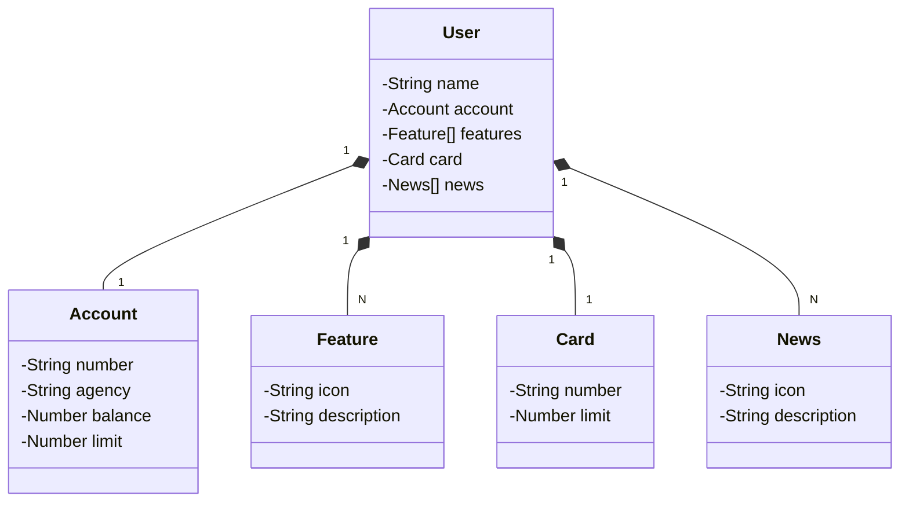

# Trilha de Aprendizado Java - EDUC360

Java RESTFul API criada para a simulação de um banco digital 

## Principais Tecnologias
- **Java 24.0.1**: Utilizaremos a versão LTS mais recente do Java para tirar vantagem das últimas inovações que essa linguagem robusta e amplamente utilizada oferece;
- **Spring Boot 3.5.0**: Trabalharemos com a mais nova versão do Spring Boot, que maximiza a produtividade do desenvolvedor por meio de sua poderosa premissa de autoconfiguração;
- **Spring Data JPA**: Exploraremos como essa ferramenta pode simplificar nossa camada de acesso aos dados, facilitando a integração com bancos de dados SQL;
- **OpenAPI (Swagger)**: Vamos criar uma documentação de API eficaz e fácil de entender usando a OpenAPI (Swagger), perfeitamente alinhada com a alta produtividade que o Spring Boot oferece;

- Para visualizar os recursos da API
http://localhost:8080/swagger-ui/index.html

## Diagrama de Classes (Domínio da API)

https://www.youtube.com/watch?v=nDst-CRKt_k  

