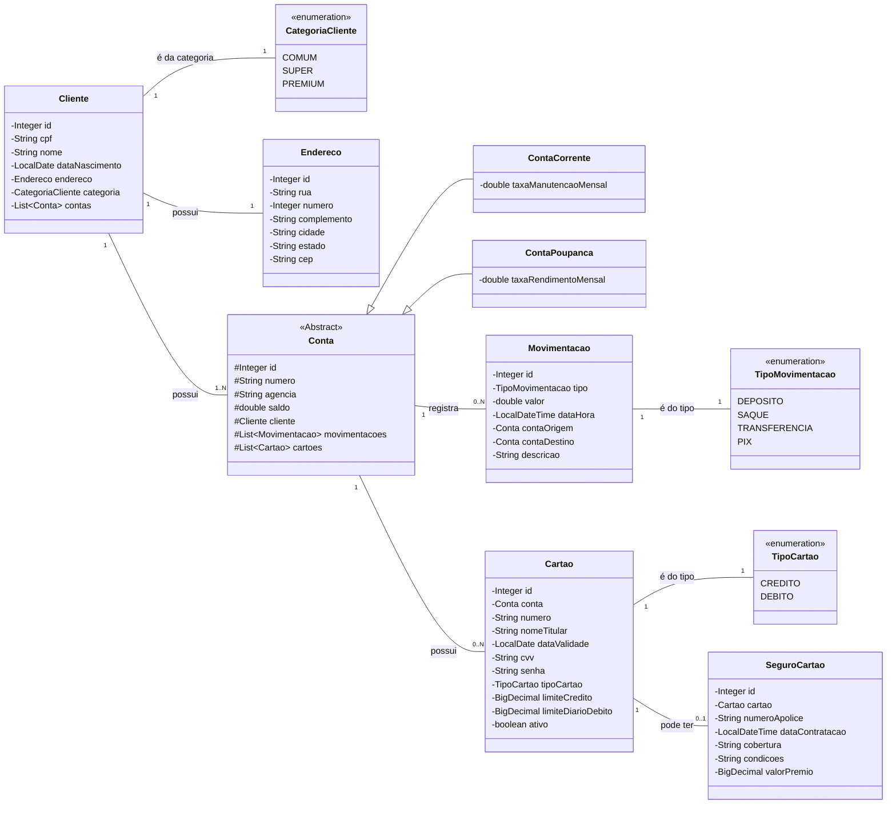

# Trilha de Aprendizado Java - EDUC360

Java RESTFul API criada para a simulação de um banco digital 

## Principais Tecnologias
- **Java 17**: Utilizei a versão LTS (Long Term Support) do Java para aproveitar as inovações e a robustez que essa linguagem oferece, garantindo performance e escalabilidade.
- **Spring Boot 3.3.1**: Trabalhei com a mais nova versão do Spring Boot, que maximiza a produtividade do desenvolvedor por meio de sua poderosa premissa de autoconfiguração.
- **Spring Data JPA**: Explorei como essa ferramenta pode simplificar minha camada de acesso aos dados, facilitando a integração com bancos de dados SQL.
- **Spring JDBC Template**: Para cenários que exigiam maior controle sobre as instruções SQL ou otimizações de performance, utilizei o Spring JDBC Template. Ele simplifica a interação com o banco de dados via JDBC, tratando o boilerplate de abertura e fechamento de conexões e convertendo exceções, o que me permitiu focar na lógica da query.
- **Spring Security**: Implementei a segurança da API utilizando o Spring Security, garantindo autenticação e autorização robustas para proteger os recursos do banco digital.
- **JWT (JSON Web Tokens)**: Para a autenticação, empreguei JWT, um método seguro e eficiente para transmitir informações entre as partes como um objeto JSON.
- **H2 Database**: Para desenvolvimento e testes, utilizei o H2, um banco de dados relacional em memória que agiliza o ciclo de desenvolvimento.
- **OpenAPI (Swagger)**: Criei uma documentação de API eficaz e fácil de entender usando a OpenAPI (Swagger), perfeitamente alinhada com a alta produtividade que o Spring Boot oferece.

## Link para visualizar os recursos da API

http://localhost:8080/swagger-ui/index.html


## Diagrama de Classes (Domínio da API)



## Fluxo de Camadas (Visão Estrutural)


## Fluxo de Requisição (Visão de Processamento)


```mermaid
%% Fluxo da Operação de Depósito
graph TD
    subgraph "Início da Requisição"
        A[POST /contas/{id}/deposito com DTO(valor)]
    end

    subgraph "Camada de Serviço (@Transactional)"
        B{Valor do depósito é positivo?}
        B -- Não --> C[Lança Erro de Validação<br/>(IllegalArgumentException)]
        B -- Sim --> D[Busca conta de destino pelo ID]
        D --> E{Conta de destino existe?}
        E -- Não --> F[Lança Erro<br/>(EntidadeNaoEncontradaException)]
        E -- Sim --> G((Início da Transação))
        G --> H[1. Adiciona valor ao saldo da conta]
        H --> I[2. Atualiza a conta no banco (UPDATE)]
        I --> J[3. Cria registro de Movimentacao<br/>(tipo=DEPOSITO, origem=null)]
        J --> K[4. Salva a movimentação no banco (INSERT)]
        K --> L((Fim da Transação))
    end

    subgraph "Fim da Requisição"
        L -- Commit --> M((Sucesso<br/>Retorna 200 OK com 'Recibo'))
        C --> Z((Falha<br/>Retorna Erro 422))
        F --> Z
        %% Qualquer falha dentro da transação leva ao Rollback
        H -- Falha no DB --> R((Rollback))
        I -- Falha no DB --> R
        J -- Falha no DB --> R
        K -- Falha no DB --> R
        R --> Y((Falha<br/>Retorna Erro 500))
    end
    
    style M fill:#d4edda,stroke:#c3e6cb
    style Z fill:#f8d7da,stroke:#f5c6cb
    style Y fill:#f8d7da,stroke:#f5c6cb
```